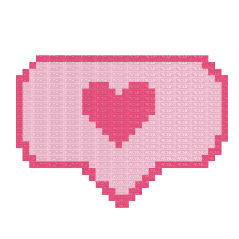
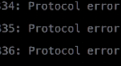
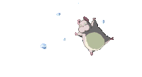

<!-- ESPACIO BANNER SUPERIOR -->

  

## Encantada, soy Sugus! 
Soy una <strong>web dev</strong> de mente curiosa que empecé siendo autodidacta y ahora estoy en proceso de titularme oficialmente en Desarrollo de Aplicaciones Web (DAW). Mi camino en la programación mezcla la lógica estricta del código con mucha intuición, intentando siempre crear proyectos que tengan alma y sentido.

Actualemente me centro en el desarrollo de aplicaciones web y estoy explorando a tope el mundo de la <strong>ciberseguridad</strong> 

<!-- SOBRE MI -->

  

  <h3> Titulaciones:</h3>
   Diseño de Aplicaciones Web (fullstack) 
   Automatización de procesos: RPA (UIPath) 
   Ofimática en la nube e IA 
   (También soy técnica de laboratorio)
    
  
  <b> RRSS:</b> 
  
  

 

<!-- APARTADO WEB DEV (MAIN STACK) -->
<h3> Web Dev Stack</h3>

Mi ecosistema principal para el desarrollo de interfaces y aplicaciones:

** Core & Frameworks:** 

** Lenguajes:** 

**🗄️ BBDD:** 

<!-- APARTADO CIBERSEGURIDAD -->
<h3> Ciberseguridad</h3>

Explorando el lado oscuro de la fuerza (con fines éticos 🥷). Este es mi rincón para explorar sistemas, automatizar y aprender sobre seguridad:

** Sistemas Operativos favoritos:** 

** Terminal & Scripting:** 

<!-- GITHUB STATS Y CONTADOR D LENGUAJES MAS USADOS -->
###  GitHub Stats

 

<!-- BANNER INFERIOR -->

  

<!-- EXTRAS -->
<h3> El Baúl de los Extras</h3>

** Otros lenguajes:** 
 

 
 

** RPA & Otros Frameworks:** 

 

** Artificial Intelligence:** 

** IDEs & Tools:** 

** Ocio y Varios:** 

 

  

  

